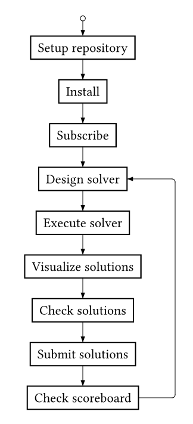

# Hackathon PMS 2026 Game Packing

The goal is to pack boxes from various board games (data comes from https://www.espritjeu.com) in a rectangular container box with minimum sum of length, width and height. Boxes may be rotated but their axis must remain aligned to the axis of the container box.

The folder `dataset` contains 21 instance files. Each CSV file is a set of boxes, the name of the instance indicates the generation method (homogeneous, heterogeneous, random). There is one row per box and the fields are the name, length, width and height of that box. 

You can solve the problem in any way you want, as long as you follow the [solution submission procedure](#submitting-solutions).
There are helpers scripts for the following toolkits:
- [Tempo](tempo/README.md)
- [CPMpy](cpmpy/README.md) 
- [Minizinc](minizinc/README.md)

<details>
<summary><b>Table of contents</b></summary>

- [Prerequesites](#prerequesites)
- [Pipeline description](#pipeline-description)
- [Repository setup](#repository-setup)
- [Installation](#installation)
- [Team subscription](#team-subscription)
- [Visualizing solutions](#visualizing-solutions)
- [Checking solutions](#checking-solutions)
- [Submitting solutions](#submitting-solutions)
- [Useful links](#useful-links)
</details>


## Prerequisites
- Blockviz: python 3.12
- Tempo: C++20 ie gcc-9, g++-13 or clang-17
- MiniZinc: minizinc compiler
- CPMpy: python 3.8


## Pipeline description
Your goal is to produce the best solutions before the end of the hackathon. No computation time is evaluated, we just compare the solutions you produce with your own system. You will submit your solutions in JSON format via a public git repository. Everything is explained in the following sections but if you are stuck on something, ask the organizers.




## Repository setup
Here is the procedure to setup your repository to submit solutions. It basically consists of copying this repository content to your new repository you will work on. You have three alternatives for this: GitHub import, GitLab import or manual.

### GitHub import
Sign in and go to your GitHub home, then click *NEW*, choose *Import a repository*, then copy/paste https://gitlab.laas.fr/roc/hackathon-pms-2026-game-packing in the text box and import as a **public** repository (this may take a few minutes).

### GitLab import
Sign in and go to your GitLab home. Click on *Projects* on the left pannel, then on *New project* and select *Import project*. Import from *Repository by URL* and copy/paste https://gitlab.laas.fr/roc/hackathon-pms-2026-game-packing.git in the text box. Make sure you select **Public** visibility and finish to fill out the form.

### Manual
The procedure basically copy files from one repository to another. Here are the steps to follow, the commands are underneath.
1. Create a new empty git repository online. Important requirement: it must be **public**.
2. Clone this repository.
3. Enter the repository
4. Remove the `.git` file.
5. Initialize a new local git repository.
6. Link your brand new remote repository.
7. Stage the current files.
8. Create the initial commit.
9. Push it on your remote repository.
```
git clone git@gitlab.laas.fr:roc/hackathon-pms-2026-game-packing.git
cd hackathon-pms-2026-game-packing
rm -rf .git
git init
git remote add origin git@github.com:user/myrepo.git
git add .
git commit -m "Initial commit."
git push --set-upstream origin main
```

## Installation
`pms` and `blockviz` python packages are necessary, regardless of your solving techniques. The first one contains scripts to check and visualize solutions while the second contains the 3D rendering system.

Then, you can choose the framework you prefer, depending on skills and constraint programming knowledge. Here are the three supported frameworks we have tested, from easiest to hardest.
- **MiniZinc** is a modelling language and tool chain for constraint optimisation problems
- **CPMpy** is a Constraint Programming and Modeling library in Python
- **Tempo** is a C++ solver developed by the organizers

### pms and blockviz
First, make sure you have at least python 3.12 installed. Then, make sure your python environment is ready. Once it is, install both `pms` with `pip`.
```
pip install git+https://gitlab.laas.fr/roc/titouan-seraud/pms.git
```
Since `pms` depends on `blockviz`, both of them are installed.

You can check the installation succeded with the following commands.
```
pms-check-repo --help
blockviz-mock | blockviz
```

If you have any issue or want more details on these packages, please read the documentation in their respective repository.
- Blockviz &rarr; [https://gitlab.laas.fr/roc/titouan-seraud/blockviz](https://gitlab.laas.fr/roc/titouan-seraud/blockviz)
- PMS &rarr; [https://gitlab.laas.fr/roc/titouan-seraud/pms](https://gitlab.laas.fr/roc/titouan-seraud/pms)

### MiniZinc
Please follow the [official installation procedure](https://docs.minizinc.dev/en/stable/installation.html).

### CPMpy
Please follow the [official installation procedure](https://cpmpy.readthedocs.io/en/latest/installation_instructions.html).

### Tempo
Please follow the [installation procedure](tempo/README.md).

## Team subscription
Careful, this step is very important: you have to find a team name! Once you have found one, fill out the [team.json](team.json) file.
```json
{
    "name": "Dalton Gang",
    "members": [
        "Joe",
        "Jack",
        "William",
        "Averell"
    ]
}
```

Check the file is valid with the following command.
```
pms-check-team
```

Then send me an email with your team name and the URL of your repository at the following address [titouan.seraud@laas.fr](mailto:titouan.seraud@laas.fr?subject=PMS%20Hackathon%20Subscription&body=Team%20name:%20%0AURL:%20%0A).

Once your registration has been processed, you will see your team on the [scoreboard](https://homepages.laas.fr/tseraud/pms.html). If your team does not appear in the scoreboard after a while, please contact the organizers.


## Visualizing solutions
You can use `blockviz` to visualize the solutions you produce. There are two main ways to use it: real-time or step-by-step. Regardless of the chosen option, blockviz expects exactly one solution per line. You can check the expected format with the mock.
```
blockviz-mock --num-boxes 3 --num-scenes 5
```

To visualize the solutions in real-time, just pipe the ouput of your solver in `blockviz`. Replace `blockviz-mock` by your solver.
```
blockviz-mock | blockviz
```

Otherwise, if you want to visualize saved solutions just call `blockviz` on your file.
```
blockviz-mock --num-scenes 5 > solutions.json
blockviz solutions.json
```

Remark: if you have parsing errors, have a look at `--permissive-io` option.

Use the json `text` field as you want. For example, you can write debug information, current run time, solution count...

More info on [blockviz repository](https://gitlab.laas.fr/roc/titouan-seraud/blockviz).


## Checking solutions
You have several scripts to check your solutions in `pms` python package. To quickly check your repository, use `pms-check-repo`.
```
pms-check-repo
```

If you have a check fail status on some instance (e.g. `homo_0005.csv`), you might need more details. You can get these with `pms-check` command.
```
pms-check --instance dataset/homo_0005.csv solutions/homo_0005.json
```

More info on [pms repository](https://gitlab.laas.fr/roc/titouan-seraud/pms).


## Submitting solutions

To submit solutions, you just have to write them in [solutions](solutions), commit and push. Every solution file must follow the json format defined by `blockviz` and must contain only one line. As an example, try to submit the following solution for `homo_0005.csv`. 

First, copy paste the following in [homo_0005.json](solutions/homo_0005.json).
```json
{"boxes": [{"position": [-147, -147, 0], "size": [295, 295, 75], "color": [197, 215, 20]}, {"position": [168, -147, 0], "size": [295, 295, 70], "color": [132, 248, 207]}, {"position": [483, -147, 0], "size": [295, 295, 75], "color": [155, 244, 183]}, {"position": [-147, 168, 0], "size": [295, 295, 75], "color": [155, 244, 144]}, {"position": [168, 168, 0], "size": [295, 295, 50], "color": [71, 48, 128]}], "text": "Tutorial solution\n"}
```

Then stage, commit and push the file.
```
git add solutions/homo_0005.json
git commit -m "Tutorial solution."
git push
```

Remark: the mandatory things in your repository are `team.json` and `solutions` directory.


## Useful links
- [PMS 2026 website](https://pms2026.sciencesconf.org)
- [Hackathon scoreboard](https://homepages.laas.fr/tseraud/pms.html)
- [Blockviz repository](https://gitlab.laas.fr/roc/titouan-seraud/blockviz)
- [PMS hackathon repository](https://gitlab.laas.fr/roc/hackathon-pms-2026-game-packing)
- [PMS repository](https://gitlab.laas.fr/roc/titouan-seraud/pms)
- [Tempo repository](https://gitlab.laas.fr/roc/emmanuel-hebrard/tempo)
- [Git cheat sheet](https://git-scm.com/cheat-sheet)